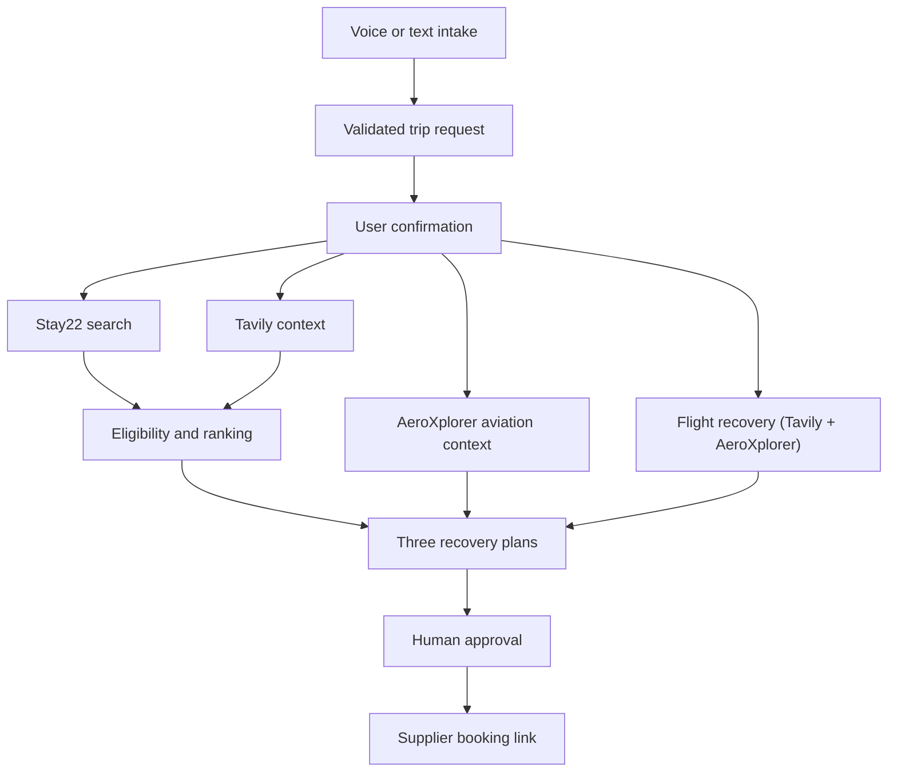

# LandingPad architecture

## Request flow

AeroXplorer and flight recovery both run concurrently with Stay22 and Tavily
and are independently settled — their evidence augments the recovery plans
display but never feeds the ranking engine (`F`) itself. A slow, failed, or
unconfigured lookup on either lane never blocks or delays hotel search,
ranking, handoff, or the approval gate.

## Trust boundary

The browser receives normalized application data, not provider credentials or raw provider errors. Stay22, Tavily, ElevenLabs, OpenAI, and AeroXplorer calls originate in server routes. Zod schemas validate both incoming user data and upstream responses. AeroXplorer's adapter (`lib/aeroxplorer/`) and the flight-recovery adapter (`lib/flight-recovery/`) additionally guard every exported entry point against client-side execution, matching the pattern already used by the ElevenLabs and OpenAI adapters.

## Demo mode vs. Active mode

A client-side `appMode: "demo" | "active"` toggle (header UI, defaults to `"demo"`) is sent on every request. Each route checks it as an early, explicit short-circuit — before touching any adapter:

- `POST /api/recovery/extract` — `appMode: "demo"` forces `extractTripRequest`'s `forceDemo` option, always using the deterministic extractor even if `OPENAI_API_KEY` is configured.
- `GET /api/stays/search` — forces `searchStays`'s `forceDemo` option, returning Stay22's own demo fixtures without any network attempt (not a failure fallback — no `warning` attached).
- `POST /api/context/search`, `POST /api/aviation/context`, `POST /api/flight-recovery/context` — return their existing "unavailable" shape immediately, without calling into `lib/tavily`, `lib/aeroxplorer`, or `lib/flight-recovery` at all.
- `GET /api/voice/signed-url` — returns `VOICE_NOT_CONFIGURED` immediately; the client also disables the voice button entirely in Demo mode as the primary gate.

This is a strictly additive, deterministic layer on top of the credential-presence fallback that already existed — `"demo"` behaves exactly like "no credentials configured" by construction, so no new fixture data was invented for any provider beyond Stay22's pre-existing demo fixtures. `"active"` is the app's original default: attempt real calls where credentials exist, degrade gracefully otherwise.

## Voice: active questioning

The ElevenLabs conversation (Active mode only) opens with a session-start override rather than passively waiting for the traveler to speak first: `overrides.agent.firstMessage` asks "what happened, and do you need a hotel, an alternate flight, or both?", and `overrides.agent.prompt` steers the rest of the conversation the same way. This requires the ElevenLabs agent's dashboard security settings to permit first-message/prompt overrides — a manual, one-time dashboard configuration step outside this codebase. If overrides aren't permitted, the call still connects using the agent's own configured behavior; nothing breaks either way. The traveler's spoken answer flows into the same transcript passed to extraction, where `assistanceScope` (`"hotel" | "flight" | "both"`) is parsed out and used to skip the flight-recovery search when the traveler explicitly asked for hotel-only.

## Product modes

`NEXT_PUBLIC_PRODUCT_MODE` accepts `recovery` or `event`. Both modes share the same `TripRequest`, Stay22 adapter, ranking engine, plan cards, evidence labels, and booking handoff. EventStay removes disruption-specific features; it does not fork the application.

## Failure contract

| Dependency | Failure behavior |
|---|---|
| Stay22 | Return typed failure and clearly labeled seeded stay data |
| Tavily | Preserve accommodation results and show local context as unavailable |
| ElevenLabs | Preserve the current state and reveal text intake |
| OpenAI | Retry structured extraction once, then use the editable deterministic form |
| AeroXplorer | Return typed unavailability; airport and hotel journeys continue unaffected |
| Flight recovery | Return typed unavailability on either lane (Tavily or AeroXplorer) independently; hotel and aviation-context journeys continue unaffected |
| Booking link | Exclude the result from final bookable plans |

## AeroXplorer aviation context

AeroXplorer is a **historical aviation-evidence provider**, not a hotel or live-status source. It supplies:

- Airport identity and metadata (name, location, coordinates) resolved from the confirmed request.
- Historical flight performance — computed from AeroXplorer's returned flight-leg records — **only** when the request carries an exact airline, flight number, origin airport, and date. An airport alone (e.g. the canonical "our flight out of JFK was cancelled" demo) triggers airport resolution only; no historical query is made.

Every AeroXplorer statement is labeled **"Historical aviation data"** / **"AeroXplorer historical records"** and carries a retrieval timestamp. It is never described as live, current, or a confirmed cancellation, and historical rates are never treated as a forecast. AeroXplorer evidence cannot change hotel eligibility, hard budget, dates, party size, or any user-confirmed constraint — the ranking engine (`lib/ai/ranking.ts`) has no reference to AeroXplorer or aviation data at all.

**Token lifecycle:** a bearer token is requested via `POST /v1/token` and cached in server-process memory, refreshed 5 minutes before its documented expiration, with concurrent requests sharing a single in-flight token request. A `401` clears the cache and retries exactly once with a fresh token; no other failure is retried. Generating a new token can invalidate a prior one for the same API key — the module-level cache is appropriate for this hackathon's single server instance but is **not** a multi-instance coordination strategy. A horizontally scaled deployment needs a centralized token broker (a shared cache/service all instances read from) so instances don't invalidate each other's tokens; that is out of scope for this MVP.

**Difference from Stay22 and Tavily:** Stay22 remains the only hotel inventory and booking-link source; Tavily remains the only current local-context source. AeroXplorer never substitutes for either — it adds a third, independent evidence lane (`aeroxplorer-historical` in the source-mode system) that explains airport/historical context without deciding anything.

## Flight recovery (assistance, not search)

LandingPad has no live flight-search, availability, or booking provider — AeroXplorer's API is historical-only (confirmed against its OpenAPI spec: token, airports, photos, historical on-time performance, historical fares, historical passenger volume; no schedule or availability endpoint exists). "Flight search or airline rebooking" was accordingly an explicit non-goal in the original build plan (`docs/build-plan.md`).

`lib/flight-recovery/` reverses only the *assistance* half of that non-goal, using providers already integrated:

- **`search.ts`** — one narrow Tavily query per route/date, mapped to up to 3 grounded search links (`tavily-web`). This is the live surface: LandingPad points the traveler at where to search, exactly like it hands off to a Stay22 supplier page rather than booking directly. It never returns a specific bookable flight.
- **`context.ts`** — a route-level (not exact-flight) historical query to AeroXplorer via a new `getRouteHistory` client method, needing only an origin airport and date (no airline or flight number, unlike the exact-flight query AeroXplorer evidence uses). Produces an on-time rate computed from the returned sample, with an explicit denominator, never a forecast.
- **`index.ts`** — `getFlightRecoveryContext` combines both independently (`Promise.allSettled`), same non-blocking pattern as `getAviationContext`.

Outbound flight links go through the same explicit approval-gate UI pattern hotel booking links already use — "nothing is booked here either." Airline rebooking (actually completing a booking) remains a real non-goal; only search assistance is in scope.

## Visual identity

`components/brand/` and `components/icons/` implement the frog-on-lily-pad brand system (mark, hero illustration, and a 13-name product icon family) described in `docs/brand-guidelines.md`. It extends the existing color/shape system in `app/globals.css` rather than replacing it — no existing token was renamed or removed.

## Sponsor roles

- Stay22 is the transactional accommodation core.
- ElevenLabs is the voice intake layer.
- Tavily grounds narrow local context with retained source URLs.
- OpenAI performs structured extraction and concise evidence-bound explanations.
- AeroXplorer supplies historical aviation evidence (airport identity, historical flight performance) — integrated, not a live-status feed.
- Anecdote Travel is an advisor-workflow prize alignment, not an asserted integration.
