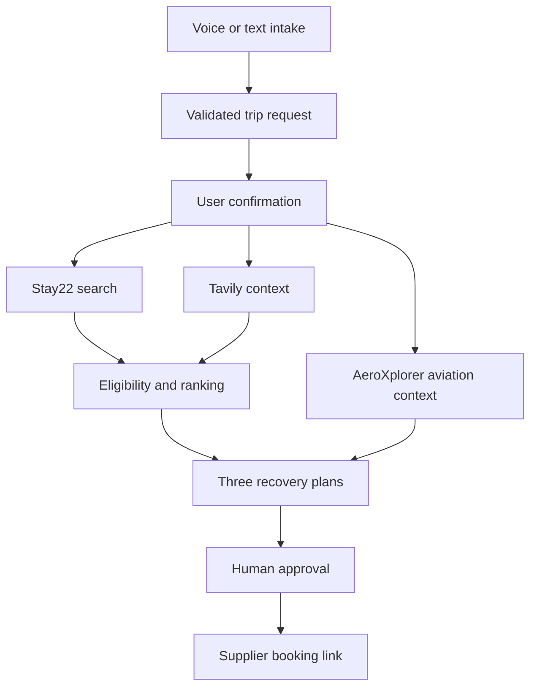

# LandingPad architecture

## Request flow

AeroXplorer runs concurrently with Stay22 and Tavily and is independently
settled — its evidence augments the recovery plans display but never feeds
the ranking engine (`F`) itself. A slow, failed, or unconfigured AeroXplorer
lookup never blocks or delays hotel search, ranking, handoff, or the approval
gate.

## Trust boundary

The browser receives normalized application data, not provider credentials or raw provider errors. Stay22, Tavily, ElevenLabs, OpenAI, and AeroXplorer calls originate in server routes. Zod schemas validate both incoming user data and upstream responses. AeroXplorer's adapter (`lib/aeroxplorer/`) additionally guards every exported entry point against client-side execution, matching the pattern already used by the ElevenLabs and OpenAI adapters.

## Product modes

`NEXT_PUBLIC_PRODUCT_MODE` accepts `recovery` or `event`. Both modes share the same `TripRequest`, Stay22 adapter, ranking engine, plan cards, evidence labels, and booking handoff. EventStay removes disruption-specific features; it does not fork the application.

## Failure contract

| Dependency | Failure behavior |
|---|---|
| Stay22 | Return typed failure and clearly labeled seeded stay data |
| Tavily | Preserve accommodation results and show local context as unavailable |
| ElevenLabs | Preserve the current state and reveal text intake |
| OpenAI | Retry structured extraction once, then use the editable deterministic form |
| AeroXplorer | Return typed unavailability; airport and hotel journeys continue unaffected |
| Booking link | Exclude the result from final bookable plans |

## AeroXplorer aviation context

AeroXplorer is a **historical aviation-evidence provider**, not a hotel or live-status source. It supplies:

- Airport identity and metadata (name, location, coordinates) resolved from the confirmed request.
- Historical flight performance — computed from AeroXplorer's returned flight-leg records — **only** when the request carries an exact airline, flight number, origin airport, and date. An airport alone (e.g. the canonical "our flight out of JFK was cancelled" demo) triggers airport resolution only; no historical query is made.

Every AeroXplorer statement is labeled **"Historical aviation data"** / **"AeroXplorer historical records"** and carries a retrieval timestamp. It is never described as live, current, or a confirmed cancellation, and historical rates are never treated as a forecast. AeroXplorer evidence cannot change hotel eligibility, hard budget, dates, party size, or any user-confirmed constraint — the ranking engine (`lib/ai/ranking.ts`) has no reference to AeroXplorer or aviation data at all.

**Token lifecycle:** a bearer token is requested via `POST /v1/token` and cached in server-process memory, refreshed 5 minutes before its documented expiration, with concurrent requests sharing a single in-flight token request. A `401` clears the cache and retries exactly once with a fresh token; no other failure is retried. Generating a new token can invalidate a prior one for the same API key — the module-level cache is appropriate for this hackathon's single server instance but is **not** a multi-instance coordination strategy. A horizontally scaled deployment needs a centralized token broker (a shared cache/service all instances read from) so instances don't invalidate each other's tokens; that is out of scope for this MVP.

**Difference from Stay22 and Tavily:** Stay22 remains the only hotel inventory and booking-link source; Tavily remains the only current local-context source. AeroXplorer never substitutes for either — it adds a third, independent evidence lane (`aeroxplorer-historical` in the source-mode system) that explains airport/historical context without deciding anything.

## Sponsor roles

- Stay22 is the transactional accommodation core.
- ElevenLabs is the voice intake layer.
- Tavily grounds narrow local context with retained source URLs.
- OpenAI performs structured extraction and concise evidence-bound explanations.
- AeroXplorer supplies historical aviation evidence (airport identity, historical flight performance) — integrated, not a live-status feed.
- Anecdote Travel is an advisor-workflow prize alignment, not an asserted integration.
