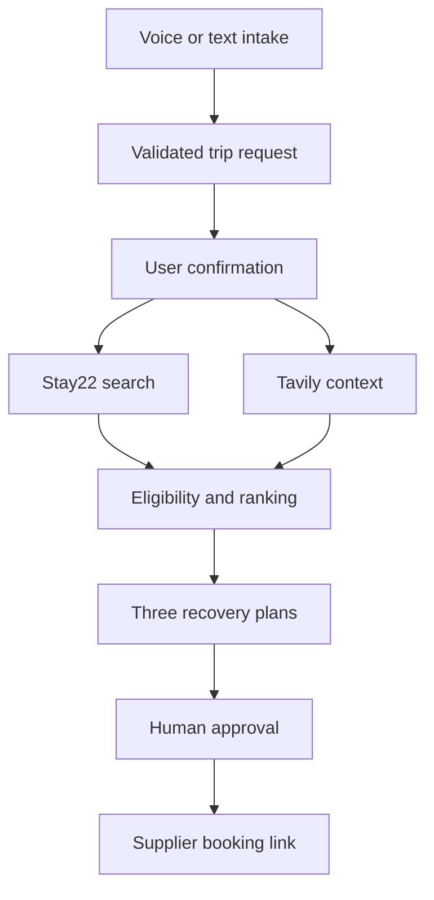

# LandingPad architecture

## Request flow

## Trust boundary

The browser receives normalized application data, not provider credentials or raw provider errors. Stay22, Tavily, ElevenLabs, and OpenAI calls originate in server routes. Zod schemas validate both incoming user data and upstream responses.

## Product modes

`NEXT_PUBLIC_PRODUCT_MODE` accepts `recovery` or `event`. Both modes share the same `TripRequest`, Stay22 adapter, ranking engine, plan cards, evidence labels, and booking handoff. EventStay removes disruption-specific features; it does not fork the application.

## Failure contract

| Dependency | Failure behavior |
|---|---|
| Stay22 | Return typed failure and clearly labeled seeded stay data |
| Tavily | Preserve accommodation results and show local context as unavailable |
| ElevenLabs | Preserve the current state and reveal text intake |
| OpenAI | Retry structured extraction once, then use the editable deterministic form |
| Booking link | Exclude the result from final bookable plans |

## Sponsor roles

- Stay22 is the transactional accommodation core.
- ElevenLabs is the voice intake layer.
- Tavily grounds narrow local context with retained source URLs.
- OpenAI performs structured extraction and concise evidence-bound explanations.
- Anecdote Travel is an advisor-workflow prize alignment, not an asserted integration.
