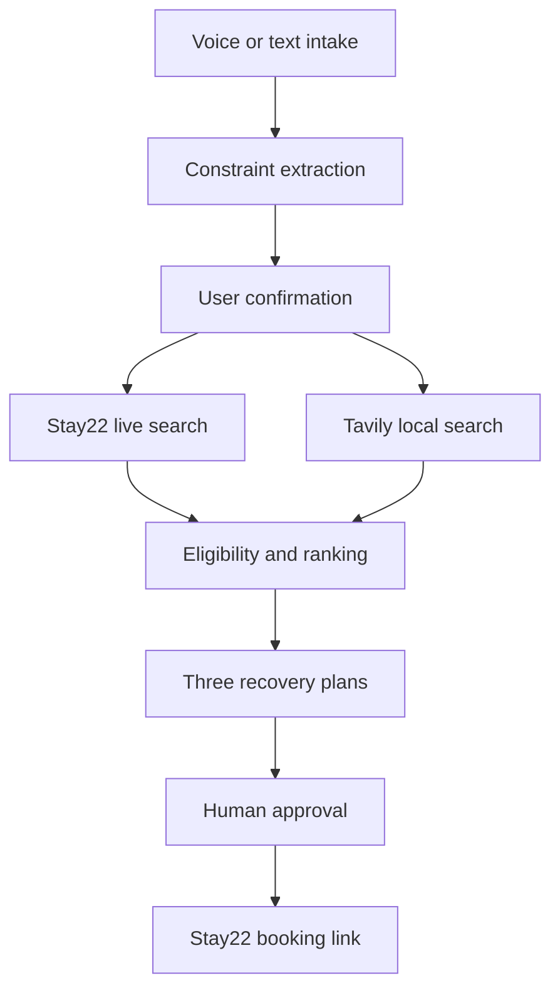

# Checkout Travel Hack NYC — Decision and Build Plan

> **Status:** LandingPad approved as the primary build; implementation intentionally paused before repository creation.
>
> **Event:** Checkout — The Travel & Hospitality Hackathon  
> **Date:** Sunday, August 9, 2026, 10:00 AM–6:00 PM EDT  
> **Format:** One-day solo build in New York City, accelerated through coordinated AI-agent workstreams  
> **Primary concept:** **LandingPad** — a voice-first travel disruption recovery advisor  
> **Fallback:** **EventStay** — an event-aware venue accommodation matcher using the same application core  
> **Primary demo:** Cancelled flight at JFK for two adults needing one room that night  
> **Voice decision:** ElevenLabs is required in the primary build; text intake remains the guaranteed fallback  
> **Decision recorded:** August 8, 2026  
> **Decision gate:** Product decisions are complete. Create a new GitHub repository only after Rex explicitly starts implementation.

---

## 1. Executive Decision

### Selected concept: LandingPad

**Approved by Rex on August 8, 2026.** LandingPad is locked as the primary build. EventStay is a planned scope-reduction path, not a competing build.

**One-sentence pitch**

> LandingPad turns “my flight was cancelled—where can I find a suitable room tonight?” into an advisor-ready recovery plan with live hotel prices, grounded local essentials, and bookable links in under two minutes.

### Why this is the strongest route

LandingPad is more memorable than a generic itinerary generator because the user begins with a high-pressure, time-sensitive problem and ends with a visible, actionable resolution. It uses Stay22 for the transactional core, ElevenLabs for a natural voice intake, Tavily for current local context, and a human-review handoff aligned with Anecdote Travel’s prize for tools that help human or agentic travel advisors work faster and provide better personalization.

It also fits Rex’s strongest build advantage: translating a complex, high-stakes workflow into a structured, guardrailed experience instead of building another open-ended chatbot.

### The 30-second judge story

1. A stranded traveler taps **Start recovery** and says what happened.
2. LandingPad extracts destination, dates, party size, budget, accessibility, and urgency.
3. Stay22 returns live accommodation pricing and booking links.
4. Tavily grounds nearby late-night food, transport, pharmacy, or airport information.
5. LandingPad ranks three recovery plans, explains each tradeoff, and lets the traveler or advisor approve one.

### Memorable demo line

> “It doesn’t plan the perfect vacation. It rescues the trip you’re already on.”

---

## 2. Official Challenge Interpretation

### Official problem statement

Travel and hospitality remains underbuilt in software, from cumbersome booking flows to legacy hotel systems. The challenge is to ship something real in one day that makes travel or hospitality better.

### Official tracks

- AI trip planning
- Hotel and hospitality operations
- Local and experiences
- Sustainability and the future of travel

### Product outcome

> Demonstrate that a disrupted traveler or travel advisor can move from an urgent, unstructured request to a safe, relevant, bookable recovery plan with less time, search friction, and uncertainty by combining conversational intake, live accommodation inventory, current web context, and explicit human approval.

### Primary user

**Traveler facing a same-day disruption**, such as a cancelled flight, missed connection, unsafe or unusable lodging, or an unexpected overnight delay.

### Secondary user

**Human travel advisor or concierge** who needs to assess constraints quickly, compare bookable options, and give the traveler a higher-quality recommendation.

### Current workaround

The traveler or advisor repeats the same search across hotel sites, maps, local guides, airline messages, and chat. They manually reconcile total price, distance, opening hours, transportation, party needs, and booking links while under time pressure.

### Required proof in the demo

The demo must visibly prove that:

1. Natural speech becomes a structured recovery brief without a long form.
2. At least one result uses live Stay22 availability, full-stay pricing, and a tracked booking link.
3. The system ranks options using the traveler’s constraints and clearly labels facts, inferences, and unknowns.
4. A traveler or advisor makes the final choice before opening a booking link.
5. The same journey still works with seeded fallback data if an API fails.

---

## 3. Sponsor and Prize Route Analysis

### Build sponsors

| Sponsor | Verified capability | Credible use in LandingPad | Priority |
|---|---|---|---:|
| **Stay22** | Unified accommodation search across Booking.com, Expedia, Hotels.com, and VRBO; live prices with dates; deeplinks; demo mode at 5 requests/minute | Live hotel/rental inventory, full-stay price comparison, supplier options, affiliate booking links | Required |
| **Rove** | Flexible travel rewards for flight and hotel redemptions | Optional user-entered miles balance and “preserve cash vs. use rewards” preference; no public integration assumed | Narrative only |
| **Propellic** | Travel marketing, content strategy, technical SEO, and AI-search visibility | Explain a future B2B distribution route: white-label recovery pages and structured, citable destination content | Strategic credit |

### Credit sponsors

| Sponsor | Verified capability | Credible use | Decision |
|---|---|---|---|
| **ElevenLabs** | Conversational voice agents, React/web integration, custom tools, personalization | Voice intake and spoken recommendation; tool call to the recovery-plan endpoint | Include in MVP |
| **Tavily** | Agent-oriented current web search with domain, date, and result controls | Ground late-night essentials, transport guidance, airport notices, and nearby services | Include in MVP, limited calls |
| **Lovable** | AI-assisted website/app creation | Could accelerate scaffolding, but is not a user-facing product capability | Optional build accelerator; do not force into demo |
| **AeroXplorer** | Aviation news and airline/aircraft coverage | Optional context source for a seeded aviation disruption scenario | Cite or link only if relevant; do not scrape or imply an API |

### Prize alignment

| Prize or judge interest | LandingPad fit | How to make the fit visible |
|---|---:|---|
| Stay22 sponsor value | High | Show real dated search, supplier-level prices, and tracked booking deeplink |
| Anecdote Travel advisor prize | Very high | Include **Advisor mode**, editable rationale, assumptions, and a handoff summary |
| ElevenLabs credits / best ElevenLabs build | High | Make voice the fastest intake path and allow the agent to call the live search tool |
| Rove Miles | Medium | Add an optional rewards preference without claiming a Rove API integration |
| Globe Thrivers | Medium | Make the final plan shareable, but avoid creator/social scope during MVP |
| Nappr | Medium | Mention daytime-room recovery as a future inventory extension; no unsupported integration |

### Sponsor-credit rules

- Credit every integrated sponsor in the README, architecture view, and demo closing slide.
- Distinguish **integrated**, **referenced**, and **future route** so the pitch never overstates use.
- Do not add a sponsor solely for logo count.
- Do not claim a Rove, AeroXplorer, Anecdote, Globe Thrivers, or Nappr API unless one is supplied at the event.
- Keep sponsor logos out of the product UI unless brand-use permission is clear; text attribution is sufficient.

---

## 4. Concept Options and Scoring

Scores are 1–5. Weighted score uses: user impact 25%, demo clarity 20%, feasibility 20%, meaningful AI 15%, differentiation 10%, and data readiness 10%.

| Concept | Impact | Demo | Feasibility | AI | Differentiation | Data | Weighted /5 | Main risk |
|---|---:|---:|---:|---:|---:|---:|---:|---|
| **LandingPad: disruption recovery advisor** | 5.0 | 5.0 | 3.7 | 4.7 | 4.6 | 4.5 | **4.57** | Real-world transport facts may be incomplete |
| Stay Near This: venue hotel matcher | 4.0 | 5.0 | 5.0 | 3.0 | 2.5 | 5.0 | **4.20** | Looks like a polished search filter |
| Advisor Copilot: broad itinerary workspace | 4.5 | 4.0 | 3.0 | 4.5 | 3.5 | 4.0 | **3.93** | Too broad for an eight-hour build |
| Accessible Stay Verifier | 5.0 | 4.0 | 2.5 | 4.0 | 5.0 | 2.0 | **3.78** | Reliable accessibility data is not guaranteed |
| Creator Stay Page Generator | 3.5 | 4.0 | 4.5 | 3.5 | 3.0 | 4.5 | **3.83** | Optimizes distribution more than traveler outcome |
| Hotel Guest Ops Voice Agent | 4.0 | 4.0 | 3.0 | 4.0 | 3.5 | 2.5 | **3.48** | Requires hotel systems or simulated operations data |

### Decision

**LandingPad is approved.** It exceeds the demo and feasibility thresholds, produces a dramatic before/after state, has a transactional live-data core, and offers the widest credible prize coverage without becoming a sponsor collage.

### Backup concept

**EventStay: event-aware venue accommodation matcher.** If LandingPad misses the implementation checkpoint, keep the same Stay22 adapter, normalized stay model, ranking engine, cards, evidence labels, and booking flow. Replace disruption intake with an event URL or venue/date form, then rank **Closest exit**, **Best value**, and **Make a weekend of it**. This is a feature reduction, not a rewrite.

---

## 5. Product Definition

### Working name

**LandingPad**

Alternative names to validate before repository creation:

- Detour Desk
- NightSafe
- Trip Recovery

### Three-sentence narrative

1. Travel disruptions force people to make expensive, high-stakes decisions across scattered sites while tired and under time pressure.
2. LandingPad uses a conversational agent to capture the situation, searches live Stay22 inventory, grounds local logistics with Tavily, and produces three ranked recovery options.
3. The traveler or human advisor sees the assumptions and tradeoffs, edits constraints, and deliberately chooses a booking link.

### Core hypothesis

> If a traveler can describe a disruption naturally and receive three constraint-aware, live, bookable recovery options with transparent tradeoffs, then they can make a confident decision faster than by manually coordinating hotel, map, and local-information searches.

### Product principles

- **Recovery over exploration:** optimize for an urgent job, not endless inspiration.
- **Three options, not thirty:** rank a safe default, a lowest-cost option, and a comfort option.
- **Facts remain facts:** show which details come from Stay22, Tavily, user input, or model inference.
- **No autonomous purchase:** the user always approves and completes booking on the supplier page.
- **Useful under failure:** live mode and demo mode follow the same interface.
- **Advisor compatible:** every result can be reviewed, edited, and handed off.

---

## 6. MVP Scope

### Core journey

1. **Start recovery**
   - Choose voice or text.
   - Load a seeded cancelled-flight example with one tap.

2. **Capture constraints**
   - Current location or target area
   - Check-in and checkout
   - Number of guests and rooms
   - Total budget and currency
   - Accessibility or mobility needs
   - Must-have needs: late check-in, airport proximity, family suitability, pet acceptance
   - Optional rewards/cash preference

3. **Confirm the recovery brief**
   - Show extracted fields.
   - Highlight missing or uncertain information.
   - Let the user edit before search.

4. **Search and ground**
   - Query Stay22 with dates for live supplier pricing and booking links.
   - Query Tavily only for the local questions needed by the selected scenario.
   - Normalize and rank results server-side.

5. **Compare three plans**
   - **Fastest recovery:** simplest path from current location.
   - **Best value:** lowest acceptable total under constraints.
   - **Best rest:** strongest comfort fit within an allowed stretch.

6. **Review and act**
   - Inspect evidence and assumptions.
   - Adjust one constraint and rerank without restarting.
   - Open the Stay22 booking deeplink.
   - Copy an advisor/traveler handoff summary.

### Must have

- [ ] Voice and text intake
- [ ] Structured extraction and confirmation
- [ ] Stay22 dated accommodation search
- [ ] Supplier-level full-stay total and booking deeplink
- [ ] Three ranked recovery plans
- [ ] One Tavily-grounded local context panel
- [ ] Source and mode labels: Live, Web-grounded, Inferred, Demo data
- [ ] Constraint editing and reranking
- [ ] Human approval before outbound booking
- [ ] Seeded scenario and reset button
- [ ] Loading, empty, error, partial, and success states
- [ ] Advisor handoff summary
- [ ] Sponsor attribution in README and architecture view

### Should have

- [ ] Spoken summary of the recommendation
- [ ] Map preview using coordinates returned by the accommodation result, if available
- [ ] Shareable recovery-plan URL stored locally for the demo
- [ ] Optional “preserve cash / use rewards” preference
- [ ] Second scenario: unusable lodging after arrival

### Explicit non-goals

> **Revised August 9, 2026:** the "Flight search" line below was decided against before AeroXplorer credentials existed. With AeroXplorer integrated, LandingPad now offers *flight search assistance* — grounded web search links plus historical on-time context — never live flight search, availability, or booking. See `docs/architecture.md` for the current boundary. Airline rebooking remains a non-goal.

- Completing or simulating payment
- Automatically making a reservation
- ~~Flight search~~ Flight search *assistance* only (grounded links + historical context, not live search) — see revision note above; airline rebooking remains a non-goal
- Claiming verified safety, accessibility, or room features not supported by source data
- Full authentication or user accounts
- Persistent storage of Stay22 listings
- General multi-day itinerary generation
- Scraping sponsor websites
- Production-grade advisor CRM integration
- Native mobile applications

---

## 7. Demo Scenarios

### Scenario A — Ideal: cancelled flight at JFK

**Approved as the primary demo scenario on August 8, 2026.**

**Seed prompt**

> “Our flight out of JFK was cancelled. Two adults need one room tonight, under $300 total, preferably within 25 minutes of the airport. We need late check-in and somewhere nearby to get food after 10 PM.”

**What the demo proves**

- Fast voice intake
- Same-day dated live search
- Budget-aware ranking
- Current local context
- Clear booking action

### Scenario B — Complex: family with mobility constraints

**Seed prompt**

> “We missed our connection and need two rooms for four adults and one child. One traveler cannot manage stairs. Keep the total under $650 and minimize transfers.”

**What it proves**

- Party and room parsing
- Accessibility uncertainty handling
- Advisor review instead of unsupported claims

### Scenario C — Edge: no acceptable live result

**Seed prompt**

> “I need a room tonight near the airport for $90 total.”

**Expected behavior**

- Do not invent availability.
- Explain that no result meets every constraint.
- Offer controlled relaxations: wider radius, higher budget, or alternate area.
- Preserve the original request for comparison.

---

## 8. Ranking Logic

### Deterministic first-pass scoring

Use rules before model-generated explanation:

```text
eligibility gate:
  dates present
  price present
  result within hard budget unless stretch is approved
  required party/room constraints not contradicted

score =
  35% price fit
  25% proximity fit
  15% recovery-friction fit
  15% stated preference fit
  10% source completeness
```

### AI role

The model may:

- Extract structured constraints from natural language.
- Identify missing information.
- Summarize tradeoffs among eligible results.
- Generate an advisor handoff.

The model may not:

- Invent prices, availability, amenities, travel time, safety, or accessibility.
- Override a hard constraint without labeling the relaxation.
- fabricate a source or booking link.
- select or purchase a stay without user approval.

### Output schema

```ts
type SourceMode = "user" | "stay22-live" | "tavily-web" | "inference" | "demo"

type RecoveryBrief = {
  currentLocation?: string
  targetArea: string
  checkin: string
  checkout: string
  adults: number
  children: number
  rooms: number
  currency: string
  hardBudgetTotal?: number
  stretchBudgetTotal?: number
  mustHaves: string[]
  preferences: string[]
  uncertainties: string[]
}

type StayOption = {
  id: string
  name: string
  type?: string
  supplier: string
  totalPrice: number
  currency: string
  bookingUrl: string
  coordinates?: { lat: number; lng: number }
  sourceMode: SourceMode
}

type RecoveryPlan = {
  label: "fastest" | "best-value" | "best-rest"
  stay: StayOption
  rationale: string[]
  tradeoffs: string[]
  localContext: Array<{
    claim: string
    url: string
    sourceMode: SourceMode
  }>
  assumptions: string[]
  rejectedConstraints: string[]
}
```

---

## 9. Technical Architecture

### Recommended stack

- Next.js App Router
- TypeScript
- Tailwind CSS and shadcn/ui
- Zod for every external and model response
- ElevenLabs React SDK or web widget for voice
- Stay22 Direct Travel API through a server route
- Tavily Search API through a server route
- Server-side LLM adapter for extraction and explanation
- In-memory/session storage only for the hackathon
- Vercel deployment

### Request flow



### API routes

```text
POST /api/recovery/extract
GET  /api/stays/search
POST /api/context/search
POST /api/recovery/rank
POST /api/recovery/handoff
```

### Shared-core fallback design

LandingPad and EventStay must share one implementation spine:

| Layer | Shared implementation | LandingPad-specific | EventStay fallback |
|---|---|---|---|
| Input contract | Destination, dates, party, rooms, budget, must-haves, preferences | Disruption narrative, urgency, current location | Event URL, venue, event schedule |
| Stay retrieval | Stay22 server adapter and normalized `StayOption` | Same | Same |
| Context retrieval | Tavily adapter with cited results | Transport and late-night essentials | Event facts and neighborhood context |
| Ranking | Eligibility gates, price fit, proximity fit, completeness | Recovery friction and urgency | Venue commute and after-event return |
| Results UI | Three plan cards, evidence labels, constraint drawer, booking link | Fastest recovery / Best value / Best rest | Closest exit / Best value / Make a weekend of it |
| Failure handling | Seeded data, partial results, explicit relaxations | Text fallback when voice fails | Direct form is already the fallback |

Implementation rules:

- Create a shared `TripRequest` schema containing the common fields and optional `disruption` and `event` contexts.
- Keep all Stay22 results normalized before either product mode sees them.
- Put mode-specific copy, weights, and labels in configuration rather than duplicated components.
- Use `NEXT_PUBLIC_PRODUCT_MODE=recovery|event` only as a presentation switch; do not fork the repository.
- Build and test the EventStay direct form during the static slice, even if it remains hidden in the primary demo.
- Never delete working LandingPad code during a fallback. Disable unstable voice or recovery-context features and switch the product mode.

### Stay22 integration notes

- Call `GET https://api.stay22.com/v2/accommodations` server-side.
- Use `address` or coordinates plus `checkin` and `checkout`.
- Dates are required for live supplier prices.
- Read `price.total` as the full-stay total in `meta.currency`.
- Preserve Stay22-provided top-level or supplier booking links.
- Omit `X-API-KEY` only for demo mode; respect the documented 5 requests/minute limit.
- Do not hard-store or cold-store listings and do not use results for analytics.
- Cache only briefly in memory to protect the live demo from duplicate requests.

### Failure modes

| Failure | Product behavior |
|---|---|
| Stay22 rate limit or outage | Use seeded Stay22-shaped data and show **Demo data** |
| No dated price | Exclude from ranked bookable options and explain why |
| Tavily unavailable | Return hotel options without local assertions; show **Local context unavailable** |
| Voice unavailable | Preserve full text input flow |
| Model extraction invalid | Retry once, then show an editable deterministic form |
| No result meets constraints | Offer explicit constraint relaxations; never silently widen |

---

## 10. Experience Plan

### Screen 1 — Recovery start

- Hero: “Tell us what changed.”
- Voice orb/button and text alternative
- Three scenario chips
- Small line: “No booking is made without your approval.”

### Screen 2 — Confirm what we heard

- Editable recovery brief
- Confidence or “needs confirmation” badges
- One primary action: **Find recovery options**

### Screen 3 — Live search

- Parallel progress states: stays, local essentials, plan ranking
- Live/demo badges
- Never show a generic full-page spinner

### Screen 4 — Compare recovery plans

- Three horizontally comparable plan cards
- Full-stay price emphasized
- Source labels and tradeoffs
- One recommended plan, with a visible explanation
- “Adjust constraints” drawer

### Screen 5 — Advisor handoff

- Copyable summary
- Confirmed facts
- Open questions
- Selected stay and booking link
- Sponsor attribution in the footer or architecture drawer, not inside the recommendation

---

## 11. Eight-Hour Build Sequence

### Solo multi-agent operating model

Rex is the solo product owner and final decision-maker. During implementation, the lead build agent should coordinate up to three specialist agents in parallel, producing team-like throughput while preserving one coherent product. If human teammates join, assign each person the corresponding workstream and retain the same contracts, checkpoints, and ownership boundaries.

#### Lead / integration owner

**Default owner:** primary build agent or Rex  
**Human-team analogue:** tech lead and product lead

Responsibilities:

- Convert this plan into the repository checklist.
- Initialize the repository and establish shared schemas before parallel work begins.
- Own `types/`, shared Zod contracts, environment conventions, and product-mode configuration.
- Define exact input/output contracts for every specialist.
- Sequence dependencies and make scope decisions at checkpoints.
- Integrate changes, run the complete test suite, resolve conflicts, deploy, and rehearse the demo.
- Remain the only owner of cross-cutting refactors, repository-wide formatting, commits, pushes, and pull-request creation unless explicitly reassigned.

#### Specialist A — Live travel data

**Human-team analogue:** backend and integrations engineer  
**Exclusive paths:** `lib/stay22/`, `lib/tavily/`, `app/api/stays/`, `app/api/context/`

Deliverables:

- Stay22 client with dated search, validation, normalization, timeout, and demo fallback.
- Tavily client limited to the primary scenario’s local-context query.
- Redacted error logging and source-mode metadata.
- Contract tests using fixtures; no persistent storage of Stay22 listings.

#### Specialist B — Voice and structured intelligence

**Human-team analogue:** conversational AI engineer  
**Exclusive paths:** `lib/voice/`, `lib/ai/`, `app/api/recovery/`

Deliverables:

- ElevenLabs voice intake and agent/tool configuration.
- Natural-language-to-`TripRequest` extraction.
- Editable confirmation output and uncertainty flags.
- Evidence-bound explanation and advisor handoff generation.
- Text fallback that uses the identical extraction and ranking contracts.

#### Specialist C — Experience and demo

**Human-team analogue:** frontend engineer, designer, and demo producer  
**Exclusive paths:** `components/`, feature pages under `app/`, `lib/data/demo-cases.ts`, and draft demo documentation

Deliverables:

- Five-screen seeded vertical slice.
- Recovery brief, progress, three-plan comparison, constraint editing, and advisor-handoff interfaces.
- Live/demo/source badges and all loading, partial, empty, and error states.
- Hidden EventStay form and mode-specific labels using the shared contracts.
- Presentation viewport polish and the first draft of the 90-second demo script.

#### Parallelization sequence

1. **Lead works first:** initialize the app, shared types, schemas, fixtures, API interfaces, and path ownership map.
2. **Spawn three bounded workstreams:** each specialist receives its paths, required contracts, acceptance tests, and stop conditions.
3. **Integrate at fixed checkpoints:** specialists report completed files, tests run, assumptions, blockers, and contract-change requests.
4. **Lead reviews before expansion:** contract changes must be approved centrally; specialists must not silently alter shared schemas.
5. **Freeze parallel feature work at 3:00 PM:** all agents shift to defects, integration, demo resilience, and documentation.

#### Coordination rules

- No two agents edit the same file concurrently.
- Specialists do not modify files outside their assigned paths without lead approval.
- Shared schemas are read-only to specialists; propose changes to the lead.
- Every handoff must state: files changed, behavior added, tests run, known gaps, and the next recommended action.
- Prefer small, reviewable patches over broad rewrites.
- Do not create duplicate adapters, types, fixtures, or UI primitives.
- Do not let agents add unapproved features under the guise of completing their workstream.
- The lead maintains one source-of-truth checklist and announces checkpoint decisions to every active workstream.
- When an API credential or product decision blocks a specialist, that specialist switches to fixtures, tests, or fallback behavior within the same workstream.

#### Human-team conversion

If teammates join, replace agents with people one-for-one:

| Team size | Assignment |
|---:|---|
| 1 | Rex acts as lead; three AI specialists operate under the boundaries above |
| 2 | Rex/lead plus one person owning live-data integrations; AI specialists cover voice and experience |
| 3 | Rex/lead, integrations owner, and experience owner; AI specialist covers voice and structured intelligence |
| 4 | One human per workstream; AI agents become implementation and QA support within each owner’s scope |

Human teammates should use separate feature branches and pull requests. Coordinated agents in one shared workspace should use exclusive file ownership and let the lead handle Git operations, avoiding simultaneous branch changes in the shared worktree.

### 10:00–10:30 — Lock and scaffold

- [x] Confirm LandingPad name and JFK cancellation scenario
- [x] Confirm solo multi-agent roles
- [ ] Confirm Stay22, ElevenLabs, Tavily, and model API access
- [ ] Create the new GitHub repository
- [ ] Initialize Next.js, shadcn/ui, environment template, and README
- [ ] Commit the seeded scenario and schemas first

**Exit:** concept can be explained in 30 seconds and the repo runs locally.

### 10:30–12:00 — Static vertical slice

- [ ] Build all five screens with seeded data
- [ ] Complete the full click path
- [ ] Add live/demo/source badges
- [ ] Implement reset

**Exit:** a complete demo works without external APIs.

### 12:00–1:15 — Stay22 live core

- [ ] Implement server-side Stay22 adapter
- [ ] Validate normalized response
- [ ] Render real dated prices and booking links
- [ ] Add timeout, brief in-memory cache, and fallback

**Exit:** the ideal case returns at least one live bookable stay.

### 1:15 — No-rewrite checkpoint

Continue with LandingPad only if all of the following are true:

- [ ] The complete text-based LandingPad journey works with seeded data.
- [ ] A dated Stay22 search returns at least one normalized live result.
- [ ] The same result cards render from both live and fallback data.
- [ ] The shared `TripRequest` can accept either disruption fields or event fields.
- [ ] EventStay can be activated by configuration and completed through booking-link handoff.

**Decision rule:** Stay with LandingPad when all five conditions pass. If any shared-core condition fails, fix the shared core before adding voice. If the shared core passes but voice/extraction is not reliable by **2:15 PM**, switch the presentation mode to EventStay and spend the remaining time on live data, event extraction, polish, and the pitch.

**Fallback cost target:** no more than 20 minutes, with no component or API-route rewrite.

### 1:15–2:15 — Voice and extraction

- [ ] Add required ElevenLabs voice entry
- [ ] Connect agent tool to extraction/search workflow
- [ ] Preserve guaranteed text fallback using the same contracts
- [ ] Test noisy and incomplete input

**Exit:** the primary prompt can be spoken and confirmed.

### 2:15–3:00 — Grounded context and ranking

- [ ] Add one constrained Tavily query
- [ ] Implement deterministic ranking
- [ ] Generate short evidence-bound explanations
- [ ] Add no-match constraint relaxation

**Exit:** three plans render with traceable rationale.

### 3:00–4:15 — Polish and resilience

- [ ] Add partial/error states
- [ ] Test demo-mode switch
- [ ] Remove dead controls
- [ ] Validate keyboard and presentation viewport
- [ ] Add sponsor credits and architecture view

**Exit:** primary path has no visible broken state.

### 4:15–5:00 — Deployment and proof

- [ ] Deploy
- [ ] Test from a clean browser
- [ ] Capture screenshots
- [ ] Record a backup demo
- [ ] Confirm outbound Stay22 links

### 5:00–6:00 — Pitch and contingency

- [ ] Rehearse a 90-second demo
- [ ] Freeze features
- [ ] Prepare backup tabs and video
- [ ] Switch to EventStay only under the documented checkpoint rule; do not improvise a late pivot

---

## 12. Demo Script

### Opening — 15 seconds

> “Travel planners optimize the trip you hope to take. LandingPad rescues the trip you’re already on. I’ve just had a flight cancelled at JFK, and I need somewhere bookable tonight.”

### Voice intake — 20 seconds

Speak the seeded request. Show the structured brief and correct one extracted field to demonstrate control.

### Live result — 30 seconds

Show the Stay22 live badge, full-stay prices, three plan labels, and one current local-context item. Open the evidence panel briefly.

### Advisor handoff and action — 20 seconds

Copy the advisor summary, then click the Stay22 booking link for the selected plan.

### Close — 5 seconds

> “From disruption to a bookable, advisor-ready recovery plan in under two minutes.”

---

## 13. Success Metrics

### Demo success

- Recovery brief confirmed in under 30 seconds
- First ranked plan shown in under 10 seconds after confirmation
- At least one live dated Stay22 result
- Every material claim has a source mode
- User reaches a booking link in five actions or fewer after confirmation
- Full fallback demo works offline from external APIs

### Product hypotheses for later validation

- Median time to advisor-ready shortlist
- Percentage of requests resolved without restarting search
- Constraint correction rate
- Booking-link click-through rate
- Advisor acceptance/edit rate
- Percentage of searches requiring budget or radius relaxation

Do not present these as measured outcomes during the hackathon.

---

## 14. Risks and Mitigations

| Risk | Severity | Mitigation |
|---|---:|---|
| Overbuilding a voice agent | High | Complete text-based vertical slice first; voice is an input layer |
| Stay22 demo-rate limit | High | Debounce, short in-memory cache, one live query per confirmed brief, seeded fallback |
| Unsupported hotel attributes | High | Mark unknowns and ask user to verify on supplier page |
| Tavily results are noisy | Medium | Use narrow queries, small result count, source URLs, and no unsupported synthesis |
| Sponsor collage weakens story | Medium | Keep Stay22, ElevenLabs, and Tavily in the core; others are credited routes only |
| Generic AI trip-planner perception | High | Lead with disruption recovery and advisor handoff, not itinerary generation |
| No public Rove integration | Low | Treat rewards as a user preference and future integration only |
| Accessibility claims create false confidence | High | Never mark a stay accessible without sourced evidence; surface verification need |

---

## 15. Repository Gate and Proposed Setup

No repository should be created until Rex approves:

1. **Concept:** LandingPad with EventStay as the no-rewrite fallback — **approved August 8, 2026**
2. **Primary scenario:** cancelled flight at JFK — **approved August 8, 2026**
3. **Voice priority:** ElevenLabs required with guaranteed text fallback — **approved August 8, 2026**
4. **Team shape:** solo with coordinated specialist agents; human teammates can inherit those workstreams — **approved August 8, 2026**

All product gates are complete. Repository creation still requires an explicit implementation start from Rex.

### Pre-hackathon API-account and credential checklist

Complete this checklist before repository implementation begins. Never paste a secret key into chat, a ticket, a README, a screenshot, or a client-side environment variable.

#### 1. Stay22 Direct Travel API

**Account setup**

- [ ] Create or sign in to the [Stay22 Hub](https://hub.stay22.com/).
- [ ] Open **Settings → API**.
- [ ] Create a token named `landingpad-hackathon-2026`.
- [ ] Copy the token once into a password manager or secrets vault.
- [ ] Confirm the account/partner attribution is correct so returned booking links carry the intended Stay22 `aid`.

**Repository and deployment configuration**

```dotenv
STAY22_API_KEY=replace_with_server_side_key
STAY22_API_BASE_URL=https://api.stay22.com
```

- [ ] Keep both variables server-side; never prefix the key with `NEXT_PUBLIC_`.
- [ ] Add the variables to `.env.local` for local development.
- [ ] Add the key to the deployment provider’s encrypted environment settings for Preview and Production.
- [ ] Commit only the variable names with blank/example values in `.env.example`.

**Minimum verification**

```bash
curl -sS -G "https://api.stay22.com/v2/accommodations" \
  -H "X-API-KEY: $STAY22_API_KEY" \
  --data-urlencode "address=John F. Kennedy International Airport, New York" \
  --data-urlencode "checkin=2026-08-09" \
  --data-urlencode "checkout=2026-08-10"
```

- [ ] Confirm HTTP 200.
- [ ] Confirm `meta.currency`, `meta.nights`, and at least one `results[]` item are returned.
- [ ] Confirm at least one supplier includes `price.total` and a Stay22 booking `link` or result `url`.
- [ ] Run one request without the header and confirm demo mode works as the emergency fallback.
- [ ] Design for the documented demo limit of 5 requests/minute and keyed limit of 100 requests/minute; still debounce and briefly cache repeated demo searches.
- [ ] Do not persist or analyze Stay22 listing inventory.

**Ready when:** a dated JFK search returns a full-stay total and an outbound booking link in both code and the browser flow.

#### 2. ElevenLabs / ElevenAgents

**Account setup**

- [ ] Create or sign in to the [ElevenLabs dashboard](https://elevenlabs.io/app/).
- [ ] Confirm available conversational-agent credits are sufficient for repeated rehearsal and the live demo.
- [ ] Create a restricted API key named `landingpad-hackathon-2026`.
- [ ] Restrict the key to only the API scopes needed for conversational agents and signed conversation access.
- [ ] Add a conservative credit quota to the key.
- [ ] Create a private ElevenAgent named `LandingPad Recovery Advisor`.
- [ ] Record the returned agent ID separately from the secret API key.
- [ ] Configure the agent’s first message, voice, interruption behavior, maximum conversation duration, and recovery-intake prompt.
- [ ] Configure the recovery-plan tool only after the app exposes a stable HTTPS endpoint.

**Repository and deployment configuration**

```dotenv
ELEVENLABS_API_KEY=replace_with_server_side_key
ELEVENLABS_AGENT_ID=replace_with_agent_id
```

- [ ] Keep `ELEVENLABS_API_KEY` server-side.
- [ ] Do not put the API key in React code or any `NEXT_PUBLIC_` variable.
- [ ] Generate short-lived signed conversation URLs from a server route; ElevenLabs documents a 15-minute expiry.
- [ ] Add the eventual deployed hostname to the agent allowlist if domain restrictions are enabled.
- [ ] Keep text intake fully functional without ElevenLabs.

**Minimum verification**

```bash
curl -sS -G "https://api.elevenlabs.io/v1/convai/conversation/get-signed-url" \
  -H "xi-api-key: $ELEVENLABS_API_KEY" \
  --data-urlencode "agent_id=$ELEVENLABS_AGENT_ID"
```

- [ ] Confirm the response contains a `signed_url`; do not save or share that temporary URL.
- [ ] Start a browser conversation using the signed URL.
- [ ] Confirm microphone permission, input transcription, interruption, and audio playback.
- [ ] Speak the approved JFK scenario and confirm the structured brief contains two adults, one room, tonight, the total budget, and airport proximity.
- [ ] Deny microphone access once and confirm the UI immediately offers text entry.
- [ ] Exhaust or simulate an ElevenLabs failure and confirm the rest of LandingPad remains usable.

**Ready when:** a private browser session can obtain a signed URL server-side, complete the spoken JFK intake, and recover to text without reloading.

#### 3. Tavily Search API

**Account setup**

- [ ] Create or sign in to the [Tavily Platform](https://app.tavily.com/).
- [ ] Copy a dedicated API key for LandingPad.
- [ ] Create or record a LandingPad project ID if project-level usage tracking is enabled.
- [ ] Confirm the dashboard shows sufficient credits; Tavily currently documents 1,000 free credits/month without a credit card.
- [ ] Decide which domains should be preferred for airport, transit, pharmacy, and late-night service facts.

**Repository and deployment configuration**

```dotenv
TAVILY_API_KEY=replace_with_server_side_key
TAVILY_PROJECT=replace_with_project_id_if_used
```

- [ ] Keep the API key server-side.
- [ ] Use `search_depth: "basic"`, a low `max_results`, and one narrow query for the primary demo.
- [ ] Return source URLs with any local-context claim.
- [ ] Do not let Tavily failure block accommodation results.

**Minimum verification**

```bash
curl -sS -X POST "https://api.tavily.com/search" \
  -H "Authorization: Bearer $TAVILY_API_KEY" \
  -H "Content-Type: application/json" \
  -d '{"query":"official late-night ground transportation and traveler services at JFK Airport","search_depth":"basic","max_results":3,"include_answer":false}'
```

- [ ] Confirm HTTP 200 and a non-empty `results` array.
- [ ] Confirm each displayed claim retains its source URL.
- [ ] Confirm a no-results or quota error produces **Local context unavailable** without blocking stay search.
- [ ] Inspect the Tavily usage dashboard after the test and confirm the request is attributed to the intended key/project.

**Ready when:** one narrow search returns usable cited context and its failure state leaves the booking workflow intact.

#### 4. OpenAI model API

**Account and billing setup**

- [ ] Sign in to the [OpenAI Platform](https://platform.openai.com/); ChatGPT Plus and API billing are separate.
- [ ] Create a project named `LandingPad Hackathon 2026`.
- [ ] Add an API payment method or confirm sufficient API credits.
- [ ] Set a conservative project budget and usage alerts appropriate for one day of development and demonstration.
- [ ] Create a project API key rather than reusing a personal key from another application.
- [ ] Use a restricted key if the required endpoint permissions can be narrowed without blocking the Responses API.
- [ ] Confirm access to the chosen model before implementation; start with `gpt-5.6` for the documented quickstart and change only after a measured latency/cost check.

**Repository and deployment configuration**

```dotenv
OPENAI_API_KEY=replace_with_project_api_key
OPENAI_MODEL=gpt-5.6
```

- [ ] Keep the key server-side and rely on the official SDK reading `OPENAI_API_KEY`.
- [ ] Do not use an OpenAI Admin API key; LandingPad requires a standard project API key.
- [ ] Do not share one personal key with future teammates. Invite them to the project or issue separate project keys.
- [ ] Configure the same variables in the deployment provider’s encrypted environment settings.

**Minimum verification**

```bash
curl -sS "https://api.openai.com/v1/responses" \
  -H "Authorization: Bearer $OPENAI_API_KEY" \
  -H "Content-Type: application/json" \
  -d '{"model":"gpt-5.6","input":"Return only the JSON object {\"status\":\"ready\"}."}'
```

- [ ] Confirm HTTP 200 and a usable output.
- [ ] Confirm the project usage dashboard records the request.
- [ ] Run the actual `TripRequest` structured-output schema against the JFK seed prompt.
- [ ] Confirm invalid model output retries once and then opens the deterministic editable form.
- [ ] Confirm the app can run with a seeded extraction when the model key is absent.

**Ready when:** the project can produce a validated `TripRequest`, record usage to the correct project, and fall back deterministically.

#### 5. Deployment and repository secrets

- [ ] Sign in to GitHub and the intended Vercel account before the event.
- [ ] Confirm Vercel can access the new repository once it is created.
- [ ] Ensure `.gitignore` excludes `.env`, `.env.local`, `.env.*.local`, logs, and local credential files.
- [ ] Commit an `.env.example` containing names and safe placeholders only.
- [ ] Add every server secret separately to Vercel Preview and Production environments.
- [ ] Use a different secret value per provider; never reuse a key or password.
- [ ] Confirm deployment logs redact request headers and never serialize environment variables.
- [ ] Confirm the browser bundle contains no server secret by searching the built client assets before deployment.
- [ ] Turn on GitHub secret scanning when available.
- [ ] If a key is exposed, revoke it immediately, create a replacement, update local and deployment secrets, and retest before continuing.

#### 6. Canonical `.env.example`

```dotenv
# Stay22 — server only
STAY22_API_KEY=
STAY22_API_BASE_URL=https://api.stay22.com

# ElevenLabs — server only
ELEVENLABS_API_KEY=
ELEVENLABS_AGENT_ID=

# Tavily — server only
TAVILY_API_KEY=
TAVILY_PROJECT=

# OpenAI — server only
OPENAI_API_KEY=
OPENAI_MODEL=gpt-5.6

# Product configuration — safe to expose only if intentionally prefixed
NEXT_PUBLIC_PRODUCT_MODE=recovery
```

#### 7. Five-minute final preflight

- [ ] All four server keys are present locally without printing their values.
- [ ] Stay22 dated JFK request succeeds.
- [ ] ElevenLabs signed URL and microphone flow succeed.
- [ ] Tavily narrow search succeeds with sources.
- [ ] OpenAI structured extraction succeeds.
- [ ] Text-only seeded workflow succeeds with every external key disabled.
- [ ] Production deployment succeeds in a private/incognito browser.
- [ ] Booking link opens the expected Stay22-routed supplier page.
- [ ] No key appears in Git history, browser source, console output, screenshots, or the demo recording.
- [ ] Keep a local fallback build, seeded JSON, and recorded demo available.

### Proposed repository

```text
name: landingpad-travel-recovery
visibility: public unless sponsor keys or event rules require private
default branch: main
license: MIT, subject to event/team agreement
```

### First repository deliverables

- `README.md` with challenge, pitch, sponsor attribution, and setup
- `.env.example` with placeholder keys only
- `docs/build-plan.md` containing this plan
- `docs/demo-script.md`
- `docs/architecture.md`
- working seeded vertical slice

Secrets must never be committed.

---

## 16. Source Notes

Primary references reviewed on August 8, 2026:

- [Checkout event invite](https://luma.com/travel-hack-nyc)
- [Stay22 Direct Travel API overview](https://dev.stay22.com/docs/api)
- [Stay22 API quickstart](https://dev.stay22.com/docs/api/quickstart)
- [Stay22 API authentication](https://dev.stay22.com/docs/api/authentication)
- [Stay22 accommodation searchbar/deeplink guidance](https://dev.stay22.com/docs/allez/searchbar)
- [ElevenLabs conversational agents overview](https://elevenlabs.io/docs/eleven-agents/overview)
- [ElevenLabs agent quickstart](https://elevenlabs.io/docs/eleven-agents/quickstart)
- [ElevenLabs agent authentication](https://elevenlabs.io/docs/eleven-agents/customization/authentication)
- [ElevenLabs agent tools](https://elevenlabs.io/docs/eleven-agents/customization/tools)
- [Tavily quickstart](https://docs.tavily.com/documentation/quickstart)
- [Tavily Search API](https://docs.tavily.com/documentation/api-reference/endpoint/search)
- [OpenAI developer quickstart](https://developers.openai.com/api/docs/quickstart)
- [OpenAI API key safety](https://help.openai.com/en/articles/5112595-best-practices-for-api-key-safety)
- [OpenAI ChatGPT and API billing separation](https://help.openai.com/en/articles/9039756-managing-billing-settings-on-chatgpt-web-and-platform)
- [Rove](https://rove.com/)
- [Propellic](https://www.propellic.com/)
- [Propellic AI optimization](https://www.propellic.com/ai-optimization)

### Evidence boundaries

- The invite identifies Stay22, Rove, and Propellic as sponsors and ElevenLabs, Lovable, Tavily, and AeroXplorer as credit sponsors.
- The invite lists prize routes from Rove, Nappr, Globe Thrivers, Anecdote Travel, and ElevenLabs.
- Stay22 documents demo mode, live dated prices, supplier booking links, and restrictions on persistent listing storage.
- No public Rove or AeroXplorer developer integration was assumed in this plan.
- Exact judging weights and submission mechanics were not published on the reviewed invite; the scoring rubric is a planning heuristic, not an official judging rubric.

---

## 17. Final Decision Checklist

- [x] Main invite reviewed
- [x] Official tracks reviewed
- [x] Sponsor and credit-sponsor routes evaluated
- [x] Prize alignment evaluated
- [x] Stay22 build constraints verified
- [x] Concepts scored
- [x] Primary and backup concepts selected
- [x] One-day scope defined
- [x] Repository creation deferred
- [x] Rex approves LandingPad with EventStay as the no-rewrite fallback
- [x] Shared implementation spine and timed fallback checkpoint defined
- [x] Rex confirms JFK cancellation as the primary demo scenario
- [x] Rex confirms LandingPad as the working product name
- [x] Rex confirms ElevenLabs voice priority and text fallback
- [x] Rex confirms solo multi-agent operating model
- [x] Agent-to-human workstream conversion instructions defined
- [x] Exact API-account, credential, verification, and secret-handling checklist defined
- [ ] Stay22, ElevenLabs, Tavily, and model API access confirmed
- [ ] Rex explicitly starts implementation
- [ ] New GitHub repository created
